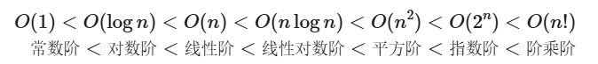
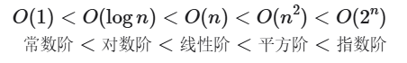

## 时间复杂度

### 定义

　　时间复杂度用于衡量**算法运行时间随着数据量变大时的增长趋势**。

　　时间复杂度的计算方法是，忽略所有的系数和常数，并且以最高阶的项决定。

### 常见的时间复杂度

　　

#### O(1)

　　与n无关。

#### O(log n)

　　当`log n`是`log2 n`时，反映了“每轮缩减一半的情况”（同理，当`log n`是`log10 n`时，反映了“每轮缩减10倍的情况”），如：

```java
int logarithmic(int n) {
    int count = 0;
    // 2^x = n，故x = log2 n
    while (n > 1) {
        n = n / 2;
        count++;
    }
    return count;
}
```

　　对数阶常见于递归：

```java
int logRecur(int n) {
    if (n <= 1)
        return 0;
    return logRecur(n / 2) + 1;
}
```

#### O(n)

　　n次循环，线性增长。

#### O(nlogn)

　　常出现在两层嵌套循环中，它们的时间复杂度分别是O(n)和O(logn)，如：

```java
int linearLogRecur(int n) {
    if (n <= 1)
        return 1;
    int count = linearLogRecur(n / 2) + linearLogRecur(n / 2);
    for (int i = 0; i < n; i++) {
        count++;
    }
    return count;
}
```

#### O(n^2)

　　常出现在两层嵌套循环中，它们的时间复杂度都是O(n)。

#### O(2^n)

　　类似于细胞分裂，一分为二、二分为四，如：

```java
int exponential(int n) {
    int count = 0, base = 1;
    // 细胞每轮一分为二，形成数列 1, 2, 4, 8, ..., 2^(n-1)
    for (int i = 0; i < n; i++) {
        for (int j = 0; j < base; j++) {
            count++;
        }
        base *= 2;
    }
    // count = 1 + 2 + 4 + 8 + .. + 2^(n-1) = 2^n - 1
    return count;
}
```

　　指数阶常见于递归：

```java
int expRecur(int n) {
    if (n == 1)
        return 1;
    return expRecur(n - 1) + expRecur(n - 1) + 1;
}
```

#### O(n!)

　　阶乘通常通过递归实现，如：

```java
int factorialRecur(int n) {
    if (n == 0)
        return 1;
    int count = 0;
    // 从 1 个分裂出 n 个
    for (int i = 0; i < n; i++) {
        count += factorialRecur(n - 1);
    }
    return count;
}
```

## 空间复杂度

### 定义

　　空间复杂度用于衡量**算法占用内存空间随着数据量变大时的增长趋势**。

### 常见的空间复杂度



#### O(1)

　　与n无关。

#### O(log n)

　　常见于分治算法，例如归并排序，输入长度为 n 的数组，每轮递归将数组从中点处划分为两半，形成高度为 log⁡n 的递归树，使用 O(log⁡n) 栈帧空间。

#### O(n)

　　线性增长。

#### O(n^2)

　　常见于矩阵。

#### O(2^n)

　　常见于二叉树，如层数为 n 的“满二叉树”的节点数量为 2n−1 ，占用 O(2n) 空间：

```java
TreeNode buildTree(int n) {
    if (n == 0)
        return null;
    TreeNode root = new TreeNode(0);
    root.left = buildTree(n - 1);
    root.right = buildTree(n - 1);
    return root;
}
```

