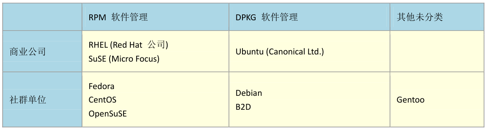

## 一、Linux版本



> RPM的在线升级指令是`YUM(yum)`，DPKG的在线升级指令是`APT(apt-get)`。

## 二、软件安装

### RPM安装

### YUM安装与升级

#### yum常用命令

　　1、查询

```bash
yum (search | info | provides) (软件名 | 文件名)
	search:通过yum服务器查找目标软件
	info:获取目标软件的详细信息
	provides:列出提供该文件的软件有哪些
```

## 三、目录、文件基本操作

### 切换目录

　　1、`cd`：切换工作目录

```bash
cd (~ | - | .. | ../..)
	~:进入用户主目录
	-:返回进入此目录之前所在的目录
	..:返回上级目录
	../..:返回上两级目录
```


### 展示目录

　　1、`tree`：以树状图展示目录及文件

```bash
tree -(C | D | f | F | p | s | N) (路径)
	-C:在文件和目录清单加上色彩，便于区分各种类型
	-D:列出文件或目录的更改时间
	-f:在每个文件或目录之前，显示完整的相对路径名称
	-F:在执行文件，目录，Socket，符号连接，管道名称名称，各自加上"*"，"/"，"@"，"|"号
	-p:列出权限标示
	-s:列出文件和目录大小
	-N:解决中文乱码问题
```

> 使用`tree`命令之前需要安装该命令，安装方法是`yum -y install tree`。

　　2、`pwd`：以绝对路径方式展示当前路径，该命令的全称是`print working directory`

```bash
pwd
```

　　3、`ls`：展示当前目录下的文件与目录

```bash
ls -(a | lh | R)
	-a:展示包括隐藏文件在内的所有文件和目录
	-lh:以单列、人类可读的方式进行展示
	-R:展示子目录的内容
```

### 搜索文件

　　1、`find`：在目录中搜索指定文件

```bash
find /home -name "*.txt" # 在home目录下搜索文件名以.txt结尾的文件或目录
find /home -iname "*.txt" # 同上，但忽略大小写
find /home -regex ".*\(\.txt\|\.pdf\)$" # 基于正则表达式进行搜索
find /home ! -name "*.txt" # 找出不是以.txt结尾的文件
```

　　2、`which`：查找并显示给定命令的绝对路径

```bash
which pwd # 查询pwd命令所在的绝对路径
```


### 查询文件内容

　　1、`tail`：输出文件的尾部内容到屏幕上

```bash
tail -n +20 1.txt # 输出从文件第20行开始到文件尾部的所有内容
tail -n -20 1.txt # 输出从文件倒数第20行开始到文件尾部的所有内容
tail -f 1.txt # 实时显示文件最新追加的内容
```

　　2、`head`：输出文件的头部内容到屏幕上

```bash
head -n +20 1.txt # 输出从文件头部开始到第20行的所有内容
head -n -20 1.txt # 输出从文件头部开始到倒数第20行的所有内容
```

　　3、`less`：浏览文件内容

```bash
less -(N) 文件名
	-N:浏览时显示行号
```

　　浏览时的按键：

　　`PageUp`、`PageDown`分别表示向上翻一页、向下翻一页。

　　`j`、`k`分别表示向上翻一行、向下翻一行。

　　`g`、`G`分别表示回到文件顶部、回到底部。

　　`q`表示退出浏览。

　　`/要搜索的内容`+回车，可以搜索文件内容，`n`向上定位，`N`向下定位。

　　4、`grep`：使用正则表达式搜索文本，并把匹配的行打印出来，全称是(global search regular expression(RE) and print out the line)

```bash
grep "hello" 1.txt # 在1.txt中搜索文本并把匹配到的行打印在屏幕上
grep -v "hello" 1.txt # 在1.txt中搜索文本并把没有匹配到的行打印在屏幕上
grep -E "[1-9]+" 1.txt # 使用正则表达式搜索文本并把匹配到的行打印在屏幕上
grep -c "hello" 1.txt # 计算匹配到的行数
grep -n "hello" 1.txt # 在1.txt中搜索文本并把匹配到的行打印在屏幕上，同时显示行号
grep -i "hello" 1.txt # 在1.txt中搜索文本并把匹配到的行打印在屏幕上，忽略字母大小写
```


### 编辑文件内容

　　**1、命令模式**

　　`i`：切换到插入模式

　　`x`：删除当前位置的字符

　　`:`：切换到底线模式

　　`o`：在当前行的下方插入一个新行，并进入插入模式

　　`O`：在当前行的上方插入一个新行，并进入插入模式

　　`u`：撤销上一次操作

　　`ctrl + r`：重做上一次撤销的操作

　　**2、插入模式**

　　`home`/`end`：移动光标到行首/行尾

　　`PageUp`/`PageDown`：上/下翻页

　　**3、底线模式**

　　`:w`：保存文件

　　`:q`：退出编辑器

　　`:q!`：强制退出编辑器，不保存修改

### 删除

　　1、`rmdir`：删除空目录

```bash
rmdir (目录名)
```

　　2、`rm`：删除文件或目录

```bash
rm -(r | f | i) (文件名 | 目录名)
	-r:递归删除
	-f:强制删除
	-i:删除已有文件或目录之前先询问用户
```

### 移动

　　1、`mv`：移动文件或目录，也可以用来修改文件名

```bash
mv 源文件 目标文件
```

　　2、`cp`：复制文件或目录

```bash
cp -(r) 源文件 目标文件
	-r:递归复制文件夹
```

### 创建

　　1、`mkdir`：创建目录

```bash
mkdir -(p) (目录名)
	-p:若所要建立目录的上层目录目前尚未建立，则会一并建立上层目录
```

　　2、`touch`：修改文件或目录的时间属性，如果文件不存在则创建新的文件

```bash
touch 文件名
```

### 修改

　　1、`chmod`：修改文件或目录的读取、写入、执行权限

　　`r`代表读取权限，代号是`4`；`w`代表写入权限，代号是`2`；`x`是执行权限，代号是`1`；`-`代表没有任何权限，代号是`0`。

```bash
chmod u=rwx,g=rw,o=r 1.txt
等价于
chmod 764 1.txt
意思是给予文件拥有者读、写、执行权限，给予文件所属群组读、写权限，给予其它用户读权限。
```

　　还可以递归修改文件夹及其子目录的权限：

```bash
chmod -R 764 ./dir1/
```

### 打包、压缩、解压

　　1、`tar`：打包、解包、压缩、解压

```bash
tar -(c | v | f | z | x) 生成文件 源文件(夹)
	-c:建立新的备份文件
	-v:显示操作过程
	-f:指定备份文件
	-z:通过gzip指令处理备份文件
	-x:从备份文件中还原文件
```

　　打包文件到一个`tar`文件：

```bash
tar -cvf 1.tar 1.txt
```

　　把一个`tar`文件解包：

```bash
tar -xvf 1.tar
```

　　打包并以`gzip`形式压缩文件：

```bash
tar -zcvf 1.tar.gz 1.txt
```

　　解压`gzip`格式文件并解包：

```bash
tar -zxvf 1.tar.gz
```

