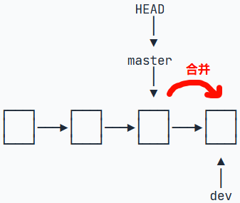
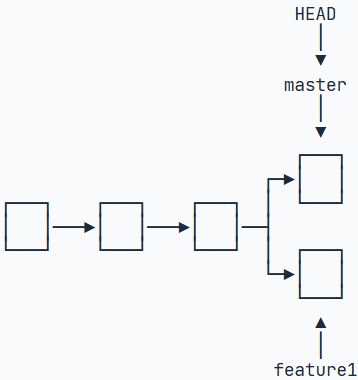
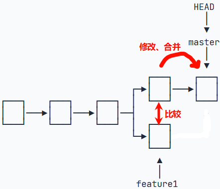
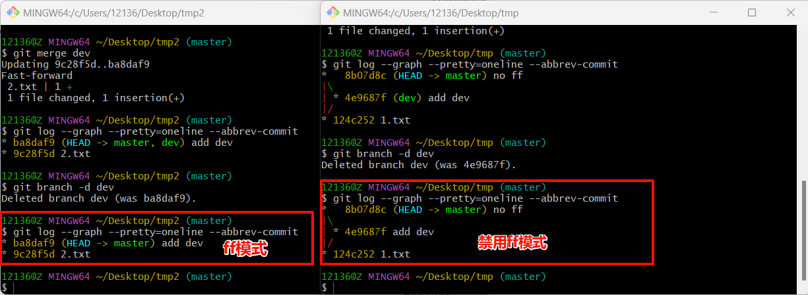

## 常用命令

　　1、查看工作区、暂存区、版本库状态

```bash
git status
```

　　2、查看提交历史

```bash
git log
```

　　3、查看分支合并历史

```bash
git log --graph --pretty=oneline --abbrev-commit
```

## 版本回退

　　版本回退主要涉及四个命令：

```bash
git reset --hard 7ec1 
git reset --soft 7ec1
git reset --mixed 7ec1 # --mixed可以省略
git checkout -- 1.txt
```

　　四个命令的作用和使用场景：

|                           | 作用                                                         | 使用场景                                                     |
| ------------------------- | ------------------------------------------------------------ | ------------------------------------------------------------ |
| **git reset --hard**      | 作用是把当前commit的版本回退到指定版本，并且在当前commit版本基础上所做的所有修改（包括工作区、暂存区的修改，但不包括版本库的修改）都会被清除。 | 1、想撤销当前所有工作区或暂存区的内容时；<br />2、想抛弃目标节点后的所有commit节点时。 |
| **git reset --soft**      | 作用是把当前commit的版本回退到指定版本，同时会保留在当前commit版本基础上所做的所有修改（工作区的修改保留在工作区，暂存区、版本库的修改保留在暂存区）。 | 1、想合并当前commit节点与目标节点之间的多个节点时。          |
| **git reset --mixed**     | 作用是把当前commit的版本回退到指定版本，同时会把在当前commit版本基础上所做的所有修改（包括工作区、暂存区、版本库的修改）保存在工作区，暂存区为空。 | 1、想修改暂存区或版本库的内容时。                            |
| **git checkout -- 1.txt** | 作用是用版本库的内容代替工作区的内容，暂存区不受影响。       | 1、想撤销工作区的修改时。                                    |

　　如果想撤销回退，或者说要回退到将来的版本，可以使用下面的命令找到commitID，然后用上面的方法撤销回退：

```bash
git reflog
```

## 远程仓库

### 创建SSH连接

　　1、在用户主目录下寻找`\.ssh\`目录，里面有`id_rsa`和`id_rsa.pub`两个文件，分别是私钥和公钥。如果没有这两个文件，需要手动生成，在该目录中打开git bash，执行下面的命令：

```bash
ssh-keygen -t rsa -C "1213630438@qq.com" # 这个邮箱和GitHub账号邮箱没有关系
```

　　2、登录GitHub，打开`Settings- SSH and GPG keys`，点击`New SSH key`，将`id_rsa.pub`中的内容复制进去并保存。

### 关联远程仓库

　　1、首先在GitHub上创建一个远程仓库`git@github.com:zyg525/learnGit.git`。

　　2、查看本地版本库关联的远程仓库：

```bash
git remote -v
```

　　将本地版本库关联到GitHub远程仓库：

```bash
git remote add origin git@github.com:zyg525/learnGit.git
```

　　如果想修改远程仓库地址，可以先删除再添加：

```bash
git remote rm origin
```

　　3、此时就可以把本地版本库的内容推送到远程仓库上：

```bash
git push -u origin master # -u的作用是把本地分支和远程分支关联起来，以后推送时就不需要再输入分支名了
```

　　4、也可以把远程仓库克隆到本地：

```bash
git clone git@github.com:zyg525/learnGit.git
```

## 分支管理

### 创建、删除分支

　　1、创建并切换分支命令

```bash
git switch -c dev
```

　　2、切换分支命令

```bash
git switch dev
```

　　3、删除分支

```bash
git branch -d dev
```

### 合并分支

　　1、合并某分支到当前分支命令

```bash
git merge dev # 合并dev分支到当前分支
```

> 所谓的合并分支，实际上是让当前分支与目标分支保持一致，在没有分支冲突的情况下，只需要把当前分支的指针移动到目标分支的指针上，就可以完成合并。分支合并时不会对目标分支造成影响。



### 分支合并冲突

　　假如出现下面这种情况，分支合并时就会发生冲突：



　　必须解决冲突后才能进行合并：



　　这种情况同样不会对目标分支造成影响。

### 合并模式

　　合并分支时默认使用`Fast forward`模式，在这种模式下，合并分支时只需要移动指针即可，优点是快，缺点是合并历史不完整；为了保留完整的合并历史，我们可以强制禁用`Fast forward`模式：

```bash
git merge --no-ff -m "merge with no-ff" dev # 由于要新建commit，所以要加上-m参数
```

　　在这种模式下进行合并，不但要移动指针，还要创建新的commit，因此合并历史是完整的。



## bug分支

　　假如要在当前工作分支上修改bug，如果工作区和暂存区不存在未提交的内容，那么只需要创建一个临时分支，在临时分支上修改bug后再和当前分支合并即可。但是如果当前工作分支的工作区、暂存区有未提交的内容，就必须先把这些内容暂时保存起来，然后再创建临时分支修改bug，等合并完成后再恢复这部分内容。

　　暂存当前分支未提交内容的命令是：

```bash
git stash # 不能暂存untracked文件
```

　　查看暂存内容的命令是：

```bash
git stash list
```

　　恢复暂存内容的命令是：

```bash
git stash apply stash@{0}
```

　　恢复暂存内容然后删除的命令是：

```bash
git stash pop stash@{0}
```

　　假如要将修改bug的内容更新到其它分支上时，不需要重复上面的操作，只需要找到bug分支的commitID，然后在需要更新的分支上使用下面的命令：

```bash
git cherry-pick 8dfe
```

## 多人协作

### 工作模式

　　多人协作的工作模式是：

　　1、推送本地修改到远程仓库：

```bash
git push origin master
```

　　2、如果远程仓库有更新，需要先更新本地版本库：

```bash
git pull origin master
```

　　如果远程和本地有冲突，解决冲突。

　　3、再次推送本地修改到远程仓库。

### pull和fetch

　　pull是拉取远程内容并与本地内容合并，fetch是仅拉取远程内容，需要使用merge手动合并，即`pull = fetch + merge`，使用`fetch`的好处是可以在合并前进行充分的检查，避免合并出错。

## rebase

　　1、[git rebase VS git merge？ 更优雅的 git 合并方式值得拥有](https://www.cnblogs.com/FraserYu/p/11192840.html)
