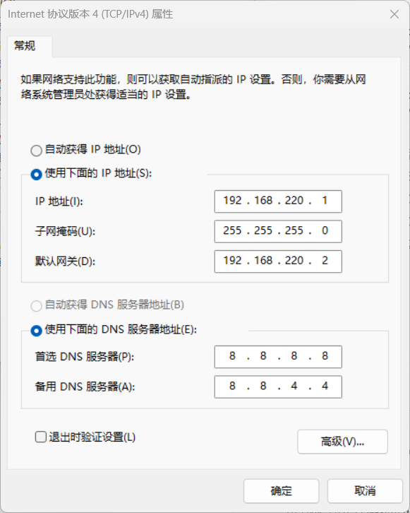

　　虚拟机版本是`VMware Workstation 17 pro`，Linux版本是`Centos7.6`。

## 一、网络重启报错问题

　　当使用`systemctl restart network`重启网络时，报错`Failed to start LSB: Bring`。

　　解决办法：禁用NetworkManager

　　1、`systemctl stop NetworkManager`

　　2、`systemctl disable NetworkManager`

　　3、重启网络，`systemctl restart network`

## 二、新建虚拟机的网络配置

　　Linux安装好之后，配置网络的步骤是：

　　1、修改`/etc/sysconfig/network-scripts/ifcfg-ens33`文件，添加或修改下面内容

```shell
BOOTPROTO="static" # 使用静态IP
ONBOOT="yes"
IPADDR=192.168.220.31 # 自定义的IP地址，注意网段要和NAT模式下的网卡保持一致
NETMASK=255.255.255.0 # 子网掩码
GATEWAY=192.168.220.2 # 网关
DNS1=8.8.8.8 # DNS
DNS2=8.8.4.4
```

　　2、重启网络

```shell
systemctl restart network
```

　　3、虚拟机会通过一个虚拟网卡和主机相连，例如`VMnet8`。在主机中修改`VMnet8`的IP为`192.168.220.1`，即虚拟机同网段的第一个号码；`VMnet8`的子网掩码和网关与虚拟机保持一致。如图所示：



## 三、为虚拟机创建全局代理

　　1、修改`/etc/profile`文件，在文件末尾添加下面内容

```shell
export http_proxy=http://192.168.0.104:37546 # 192.168.0.104是主机IP，37546是VPN软件的端口
export https_proxy=http://192.168.0.104:37546
export ftp_proxy=http://192.168.0.104:37546
export no_proxy=127.0.0.1,localhost
```

　　2、执行命令使修改生效

```shell
source /etc/profile
```

　　3、验证是否生效

```shell
wget www.google.com
```

> 注意，这种方式虽然被称为全局代理，但是并不能代理所有通信，比如Docker。

## 四、为Docker创建代理

　　为Docker创建代理的目的是方便拉取镜像，因为国内镜像无法使用，只能拉取国外镜像。

　　1、创建文件夹

```shell
mkdir -p /etc/systemd/system/docker.service.d/
```

　　2、在这个文件夹内创建文件

```shell
touch http-proxy.conf
```

　　3、编辑`http-proxy.conf`文件，配置代理，文件内容是

```shell
[Service]
Environment="HTTP_PROXY=http://192.168.0.104:37546/"
Environment="HTTPS_PROXY=http://192.168.0.104:37546/"
Environment="NO_PROXY=localhost,127.0.0.1,.example.com"
```

　　4、刷新配置并重启服务

```shell
systemctl daemon-reload
systemctl restart docker
```

