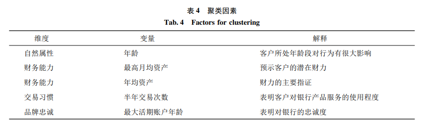

## 目标

　　1、**能够完整、清晰、流利地描述整个项目**；

　　2、**尽可能提高项目经验的可信度、含金量**，如果太困难可以不做，避免浪费时间。

## 一、项目基本情况（时间、客户、人员规模）

　　这个项目从2022年5月持续到2024年7月，客户是宁波银行，项目构成是1名项目经理，8名后端开发，3名前端开发，2名测试，1名运维。

## 二、项目需求和基本模块

### 项目需求

　　OCIF项目是宁波银行内部的一套客户信息管理系统，它的主要功能是实时整合分布在各个渠道中的网络客户信息，生成统一的客户视图，实现全行跨系统统一管理客户，有效解决网络经营客户信息共享性差、利用率低、采集重复率高等问题。

### 项目模块和业务（项目基本业务的可信度和含金量还不是很高，需要补充）

　　项目的基本模块包括三大部分：**客户信息收集系统、OCIF核心系统、渠道内客户行为分析系统**。其中客户信息收集系统的业务主要包含实时信息收集、T+1信息补偿、存量信息消费等；OCIF核心系统的业务主要包含客户信息生成、客户信息查询、客户分配、分配日志记录、用户权限管理等；渠道内客户行为分析系统的业务主要包含客户信息分析、客户信息查询、客户信息分配等。

#### 客户信息收集系统

　　**1、实时信息收集**：每个渠道有新增的用户时，都会实时地把用户信息保存在本渠道的数据库中，大数据平台会立刻获得这些数据，然后写入到Kafka中，供OCIF核心系统消费使用。大数据平台主要包括ODS、数据仓库、ADS三层，ODS中的定时任务会抽取数据库中最新的用户信息，然后送到数据仓库中，数据仓库会对这些信息进行筛选、整理、备份，紧接着ADS会从数据仓库中获取最新的用户信息，并写入到Kafka。

　　我的工作是编写python脚本，对数据仓库中的信息进行筛选、整理，比如去掉多余的字段、去掉重复的信息、字段格式转换等。

　　**2、T+1信息补偿**：由于系统不稳定等原因，可能会导致部分用户信息丢失，为了找回这部分数据，大数据平台会在每天的0点将所有渠道当天的全量用户数据和OCIF核心系统中已经消费过的用户数据进行比对，两者的差值就是丢失的数据，只需要把这部分数据写入Kafka重新进行消费即可。

　　我的工作是编写python脚本，对比数据仓库中的数据和OCIF系统中已经消费过的用户数据，求出丢失的用户信息，并重新写入到Kafka。

　　**3、存量信息消费**：当系统第一次上线时，需要将所有渠道中已有的全部用户信息都消费掉。

　　我的工作是编写python脚本，将已有的用户信息全部加载到数据仓库，然后写入到Kafka中。

#### OCIF核心系统（客户信息生成系统）

　　**1、客户信息生成**：主要生成了四种表，分别是**网络表和核心表、网络与核心映射表、属性表**。

　　网络表和核心表的生成逻辑是：通过unionid和手机号生成主键oneid和oid，然后分别插入到两张表中；对于一些附带信息，比如ecif号，多个渠道选择创建时间最早的那一个；客户可能会由外环升级为中环，由中环升级为内环，这个事件需要记录；还有一些信息需要从第三方接口中获取，比如管户人信息、ecif信息。

　　网络与核心映射表的生成逻辑是：网络表包含核心表，因此每个oneid都对应一个oid（反之则不是），这张表就是它们的映射表。

　　属性表：有一些比较重要的附加信息，比如手机号、unionid、ecif号，一个客户可能在多个渠道中的信息不同，属性表需要记录这些信息，以便进行用户行为分析。

　　主要的业务逻辑包括：**外环和中环客户的区分、客户信息的更新、客户升级、客户属性记录**。

　　**2、客户信息查询**：查询网络表、核心表、分配表中客户的各种信息。

　　**3、客户分配**：给客户分配管户人时，会把旧的管户人、新的管户人、分配人、分配时间记录在管户历史表中。

　　**4、分配日志记录**：客户分配时，调用接口、时间、操作人角色、ip等信息会被记录下来。

　　**5、用户权限管理**：用户的权限包括查询、分配。

#### 客户信息应用系统

　　该系统主要包括**客户信息管理(信息查询、管户分配、分配日志、客户流失管理)，客户分类营销()，用户管理，客户行为分析？**。

　　**1、客户信息管理**

- **信息查询**

- **管户分配**

- **分配日志**

- **客户流失管理**

　　客户流失管理分为三个部分：**流失客户的判定、流失客户的分类、流失客户的挽回**。

​	判断流失客户的相关因素如下图所示：

　　流失客户中，由于客户年龄、资产结构、交易 习惯等的差异，其流失原因和流失特征也各不相同， 如果采用相同的挽回策略，难以起到针对性营销的 效果。对流失客户进行细分，根据其不同特征划分 为不同的流失群体，针对每个流失群体进行分析， 描述其群体特征，并给出相应的挽回措施，将有助 于提高客户维护人员的工作效率和效果。因此，利 用数据挖掘技术对流失客户进行聚类细分，对每一 个细分群体分别进行群体特征分析，影响聚类细分的因素有：

　　利用 K－Means聚类算法，将流失贵宾客户细分为四个群 体，对四个群体进行分析，分别定义族群标签，描 述群体特征及提出流失挽回措施，如下图所示：

## 三、你负责的模块和业务，以及用到的技术

　　我全程参与了项目前期的需求分析、中期的代码编写、后期的项目维护工作。我参与开发了三个模块，其中客户信息收集系统用到的技术主要是大数据，OCIF核心系统和渠道内客户行为分析系统则是典型的SpringMVC架构系统，数据库使用的是Oracle，数据库映射使用的是mybatis，缓存使用了Redis，消息中间件使用了Kafka。

## 四、这些技术在项目中具体是如何使用的？（技术有点少，并且缺乏细节，导致可信度不高）

　　我们使用大数据收集各个渠道中的客户信息，然后通过Kafka将这些信息传输给OCIF核心系统，OCIF核心系统中使用了AOP来记录客户的分配日志，还使用了Redis缓存外部接口中的数据，在Redis中我们使用到了***数据类型。

## 五、简历中的亮点（缺乏细节，比如要通过数据展示成果，从而提升可信度）

　　SQL优化、AOP的应用、Kafka消费存量数据、Redis缓存接口数据。

## 六、项目管理方式（junit、git、sonar比较重要，需要比较熟悉，jenkins、jjra、autosys需要知道怎么用）

### 项目管理方式

　　项目管理方式使用瀑布模型，各个阶段的主要任务分别是：需求分析-概要设计-详细设计-编码-测试-交付-验收-维护。除此之外，为了提高开发效率，我们还采用了”每天站立会议“的形式，每天早上项目组会用大约20分钟时间讨论每个人昨天任务的完成情况、遇到的问题和解决办法，以及今天的任务。这样即使遇到困难，也不会耽误很多时间。

### 项目管理工具

　　项目中用到的工具有：JUnit用来单元测试，Jenkins用来部署项目(由运维负责)，jira管理bug，Git版本控制，Sonar管理代码质量，Autosys定时运行任务
