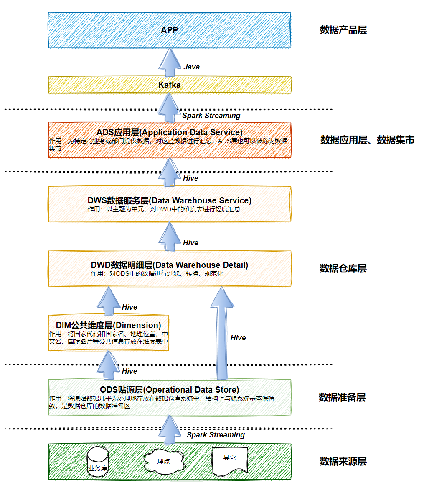

## 概述

　　数仓层内部的划分不是为了分层而分层，分层是为了解决 ETL 任务及工作流的组织、数据的流向、读写权限的控制、不同需求的满足等各类问题。业界较为通行的做法将整个数仓层又划分成了 DWD、DWT、DWS、DIM、DM等很多层。然而我们却始终说不清楚这几层之间清晰的界限是什么，或者说我们能说清楚它们之间的界限，复杂的业务场景却令我们无法真正落地执行。所以数据分层这块一般来说三层是最基础的，至于DW层如何进行切分，是根据具体的业务需求和公司场景自己去定义。

　　数据仓库的分层如下图所示：

